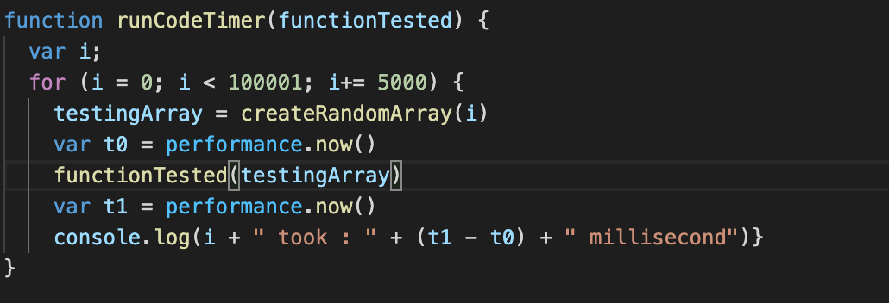

# Algorithmic complexity

## Algorithms

> a process or set of rules to be followed in calculations or other problem-solving operations, especially by a computer.

## Complexity

> Complexity of an algorithm is a measure of the amount of time and/or space required by an algorithm for an input of a given size (n).

## Timing
Using the perfomance.now function in Javascript to time the running time for arrays of difference sizes.

### Timing for default metthod

